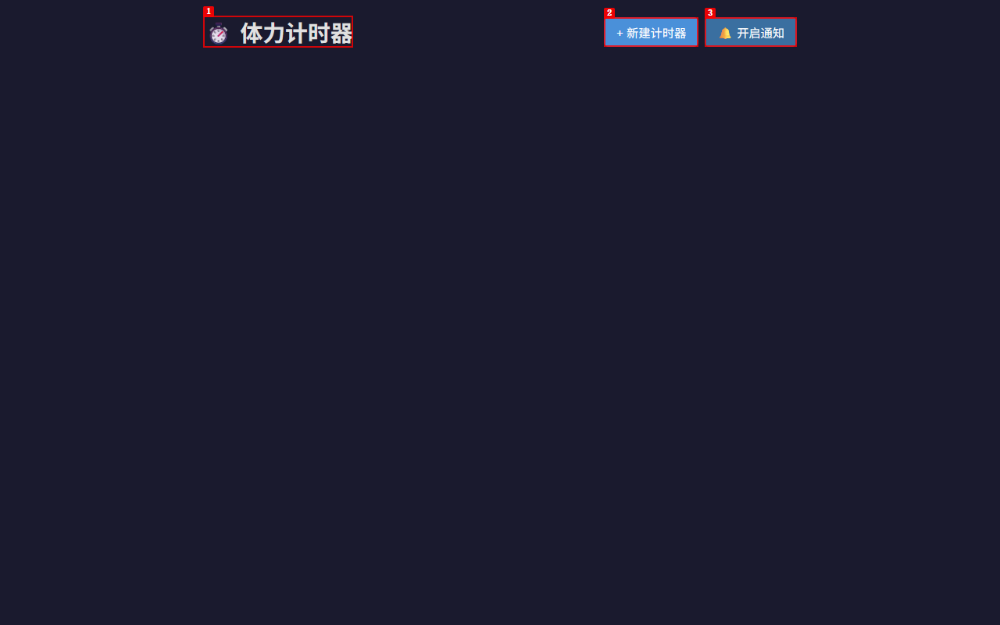
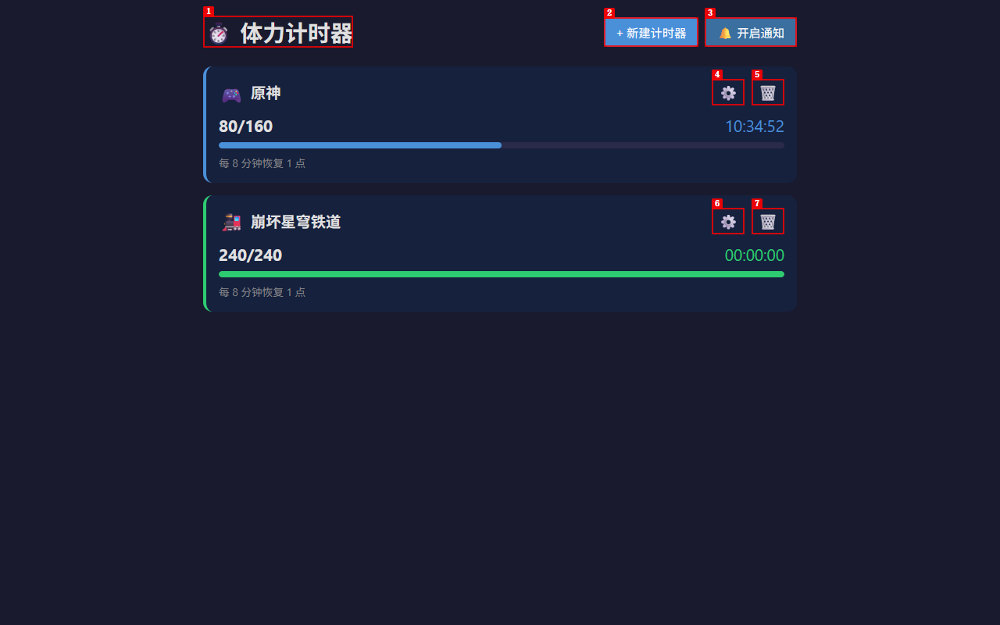
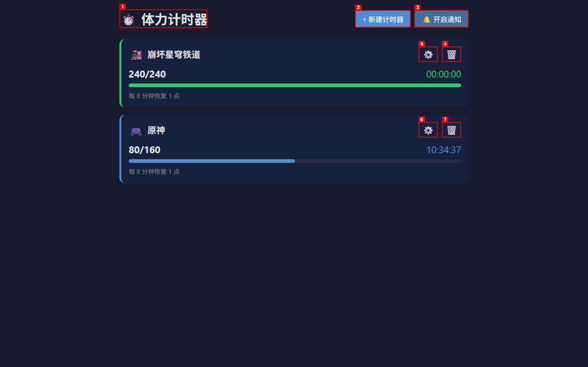
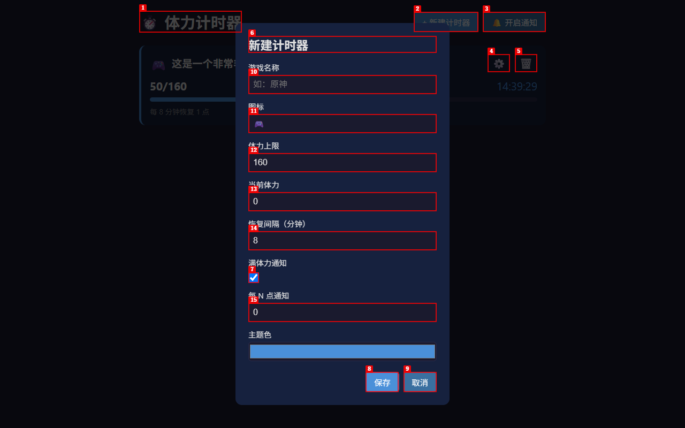
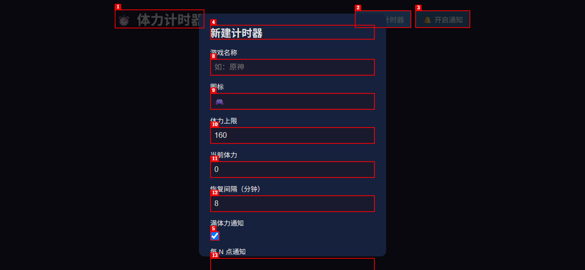
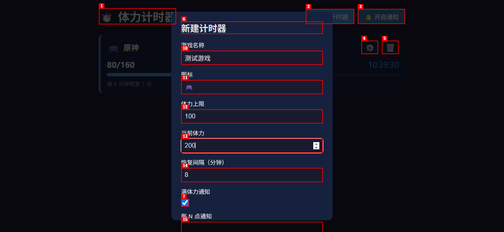
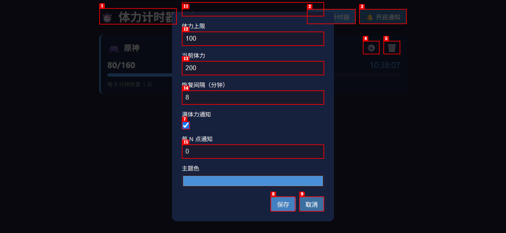
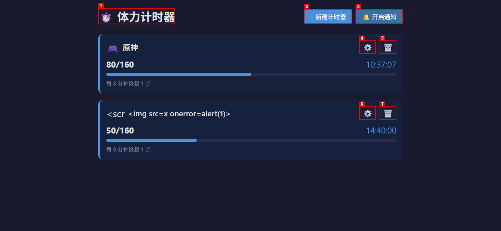
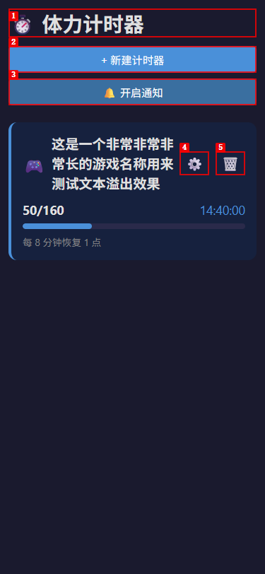
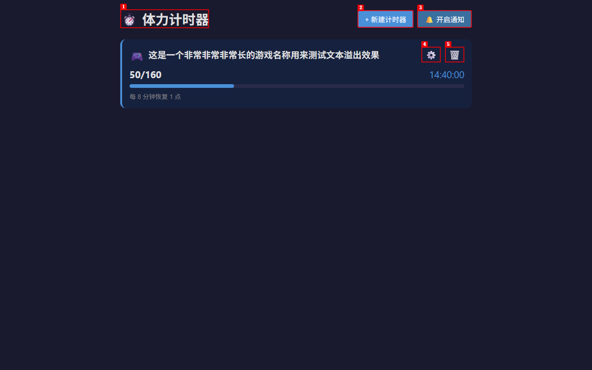

# Dogfood Report: 游戏体力计时器 (Game Stamina Timer)

| Field | Value |
|-------|-------|
| **Date** | 2026-07-11 |
| **App URL** | http://127.0.0.1:3100 |
| **Session** | stamina-timer |
| **Scope** | Full app |

## Summary

| Severity | Count |
|----------|-------|
| Critical | 0 |
| High | 0 |
| Medium | 4 |
| Low | 3 |
| **Total** | **7** |

## Issues

### ISSUE-001: Missing empty state when no timers exist

| Field | Value |
|-------|-------|
| **Severity** | medium |
| **Category** | ux |
| **URL** | http://127.0.0.1:3100 |
| **Repro Video** | N/A |

**Description**

When the app has no timers (initial visit or after deleting all timers), the main content area is completely blank. There is no empty state message, illustration, or call-to-action guiding the user to create their first timer. A new user visiting the app for the first time would see only the header and two buttons with a large empty space below, which is confusing and uninviting.

**Expected:** An empty state with a helpful message like "还没有计时器，点击「新建计时器」开始追踪吧！" and/or a visual cue pointing to the add button.

**Actual:** The `<main>` element is empty, leaving a blank page below the header.

**Repro Steps**

1. Navigate to http://127.0.0.1:3100 with no existing timers (or delete all timers)
2. **Observe:** The main content area is blank with no guidance
   

---

### ISSUE-002: Timer order is unstable across page reloads

| Field | Value |
|-------|-------|
| **Severity** | medium |
| **Category** | ux |
| **URL** | http://127.0.0.1:3100 |
| **Repro Video** | N/A |

**Description**

Timers appear in a different order after reloading the page. The app uses `IndexedDB.getAll()` which returns records in primary key order. Since the primary key is a randomly-generated UUID (`crypto.randomUUID()`), the display order is effectively random and changes between sessions. Users who arrange their timers mentally (e.g., "原神 is first, 崩坏星穹铁道 is second") will find them rearranged after a reload, which is disorienting.

**Expected:** Timers should appear in a consistent order (e.g., creation order or alphabetical by name).

**Actual:** Timer order shuffles on every page reload.

**Repro Steps**

1. Add two timers: first "原神", then "崩坏星穹铁道"
2. Observe the order before reload (原神 first, 崩坏星穹铁道 second):
   

3. Reload the page
4. **Observe:** The order has swapped (崩坏星穹铁道 first, 原神 second):
   

---

### ISSUE-003: Modal cannot be dismissed by clicking outside or pressing Escape

| Field | Value |
|-------|-------|
| **Severity** | medium |
| **Category** | ux |
| **URL** | http://127.0.0.1:3100 |
| **Repro Video** | N/A |

**Description**

The add/edit timer modal can only be closed by clicking the "取消" (Cancel) button or successfully submitting the form. Clicking on the modal overlay (outside the modal content) does nothing, and pressing the Escape key does nothing. This violates common modal interaction patterns that users expect.

**Expected:** Clicking the overlay outside the modal content should close the modal. Pressing Escape should also close the modal.

**Actual:** Neither clicking outside nor pressing Escape closes the modal. The user must find and click the "取消" button.

**Repro Steps**

1. Click "+ 新建计时器" to open the modal
2. Click on the dark overlay area outside the modal content
   

3. Press the Escape key
4. **Observe:** The modal remains open in both cases

---

### ISSUE-004: Modal lacks accessibility attributes and focus management

| Field | Value |
|-------|-------|
| **Severity** | medium |
| **Category** | accessibility |
| **URL** | http://127.0.0.1:3100 |
| **Repro Video** | N/A |

**Description**

The modal dialog lacks standard accessibility attributes. The modal `
` has no `role="dialog"`, `aria-modal="true"`, or `aria-labelledby` attributes. Additionally, focus is not moved into the modal when it opens, and focus is not returned to the triggering element (the "新建计时器" or edit button) when it closes. Screen reader users and keyboard-only users will have difficulty understanding and navigating the modal.

**Expected:** The modal should have `role="dialog"` and `aria-modal="true"`. Focus should move to the first form field (or the modal heading) when the modal opens, and return to the triggering button when it closes.

**Actual:** No ARIA attributes on the modal. No focus management on open or close.

**Repro Steps**

1. Click "+ 新建计时器" to open the modal
2. **Observe:** The modal opens but focus remains on the "新建计时器" button. The modal container has no `role` or `aria-modal` attributes:
   

---

### ISSUE-005: Uses blocking alert() dialogs for all user feedback

| Field | Value |
|-------|-------|
| **Severity** | low |
| **Category** | ux |
| **URL** | http://127.0.0.1:3100 |
| **Repro Video** | N/A |

**Description**

The app uses `alert()` for all user feedback, including form validation errors ("当前体力不能超过体力上限"), notification status ("通知已开启！"), and error messages ("保存失败"). These native alert dialogs block the entire page, preventing any interaction until dismissed. They also cannot be styled to match the app's dark theme, creating a jarring visual inconsistency. Modern web apps typically use inline validation, toast notifications, or styled modal messages instead.

**Expected:** Inline form validation or styled toast/modal notifications that don't block the page.

**Actual:** Blocking `alert()` dialogs that freeze the page and visually clash with the dark theme.

**Repro Steps**

1. Click "+ 新建计时器" to open the modal
2. Fill in a game name, set 体力上限 to 100, and 当前体力 to 200
   

3. Click "保存"
4. **Observe:** A blocking alert dialog appears, freezing the page:
   

---

### ISSUE-006: Icon field accepts arbitrary text instead of validating for emoji

| Field | Value |
|-------|-------|
| **Severity** | low |
| **Category** | ux |
| **URL** | http://127.0.0.1:3100 |
| **Repro Video** | N/A |

**Description**

The icon field accepts any text up to 4 characters (enforced by `maxlength=4` in HTML). The `validateIcon()` function only checks that the input is 1-4 characters long, but does not verify that it's a valid emoji or icon character. Users can enter arbitrary text like "abc", "<scr", or "123" as an icon, which will be displayed as plain text in the timer card instead of a meaningful icon. The HTML input also lacks a `pattern` attribute to restrict input to emoji characters.

**Expected:** The icon field should validate that the input is a valid emoji or provide a picker for common game-related emojis.

**Actual:** Any 1-4 character string is accepted and displayed as the timer icon.

**Repro Steps**

1. Click "+ 新建计时器" to open the modal
2. Enter a game name, set icon to `` (truncated to `<scr` by maxlength=4)
3. Save the timer
4. **Observe:** The timer card displays "<scr" as the icon text instead of an emoji:
   

---

### ISSUE-007: Long game names have no text truncation, causing layout issues on narrow screens

| Field | Value |
|-------|-------|
| **Severity** | low |
| **Category** | visual |
| **URL** | http://127.0.0.1:3100 |
| **Repro Video** | N/A |

**Description**

The timer name in the timer card has no `overflow: hidden`, `text-overflow: ellipsis`, or `white-space: nowrap` CSS properties. When a game name is very long (e.g., 20+ Chinese characters), the text wraps to multiple lines, expanding the card height and pushing the edit/delete buttons down. On narrow mobile screens (375px), this causes the timer card layout to look unbalanced and untidy.

**Expected:** Long names should be truncated with an ellipsis (`...`) or wrap gracefully with a max-height constraint.

**Actual:** Long names wrap freely, causing cards to grow taller and the layout to look inconsistent.

**Repro Steps**

1. Add a timer with a very long name: "这是一个非常非常非常长的游戏名称用来测试文本溢出效果"
2. View on a narrow (375px) viewport
3. **Observe:** The name wraps to multiple lines, expanding the card:
   

   On desktop (1280px), the issue is less severe but still visible:
   

---
